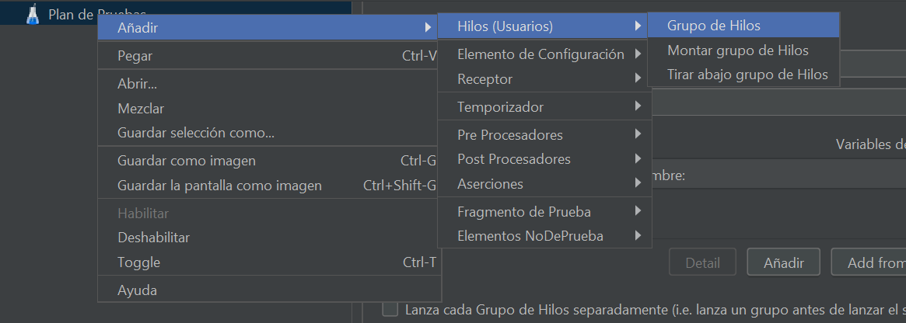
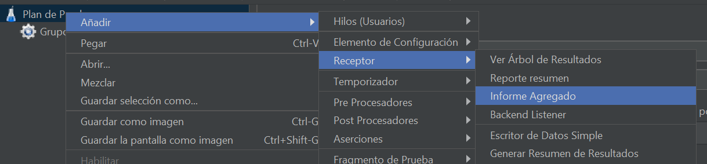
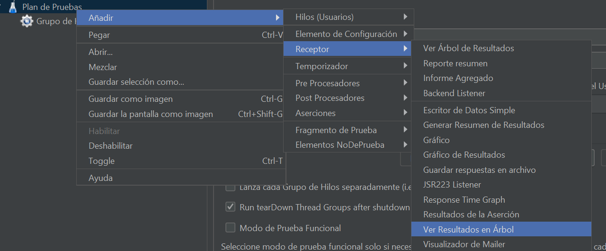
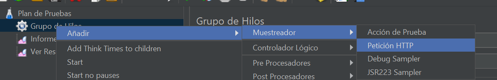
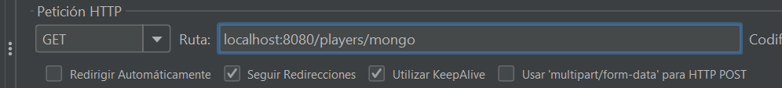
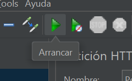
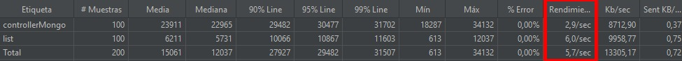

# Challenge reactor-core
# Step by Step

- Transformar un CSV una lista de Stream de Java (Usar operadores basicos)
- En vez de usar Java Stream aplicamos reactividad (Reactor Core) con trasnformaciones (Usar operadores basicos)
- Optimizar las consultas y aplicar un servicio web para hacer estos filtros
- Hacer un proceso de migración en donde tomemos los datos del archivo y lo llevemos a una base datos (MangoDB)
- Trabajo directamente los desde una base de datos reactiva y objserva la rendimiento
- Prueba de concurencia con JMeter, donde vamos a colocar 100 hilos de ejeucución para observar los comportamientos de cada servicio

# SOLUCION

Se crean los controladores, el repositorio, el servicice, la entidad, arrancamos el servicio y hacemos el llamado desde Jmeter para ver rendimiento, así:
el llamado desde el navegador

el listado de datos

ahora en Jmeter

se crean los  receptores

se agrega un agente de peticiones HTTP

Se ingresa la URL de cada servicio

y se le da play

ahi se obtendra in informa con el rendiminto del servicio pudioendo comparar cada uno.

en conclusion se pude evidenciar que al trabajar reactivanente desde una base de dato, el redimiento aumenta significativamente,debido 
a que no se hacen conversiones de ningun tipo.
